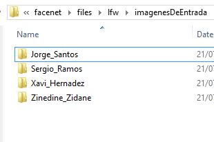
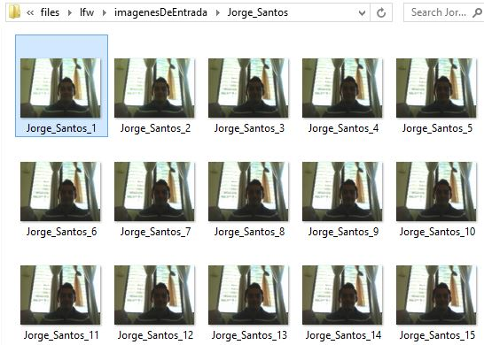
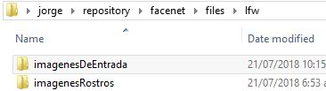
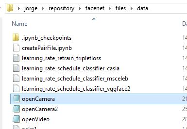
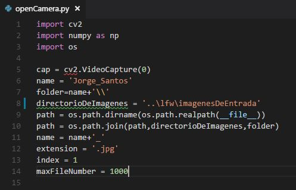
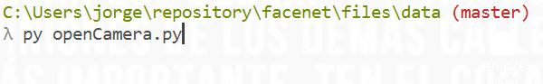

# Proyecto facenet

## Requerimientos técnicos.

Los requerimientos para trabajar con facenet son:

1. Python
2. opencv-python==3.4.0.12

Puede utilizar las siguientes guias de referencia:

 * [Instalar python y pip](https://github.com/BurntSushi/nfldb/wiki/Python-&-pip-Windows-installation)


## 1. Recopilar imagenes para el entrenamiento

Para reconocer rostros debemos alimentar Facenet con un conjunto de imagenes de entrenamiento, estas imagenes puede ser recopiladas de forma manual, por medio de una camara o por medio de un video.   Es pertinente aclarar que este procedimiento es para recopilar imagenes que luego seran alineadas y estas imagenes alineadas son forman el conjunto de datos para el entrenamiento.

El conjunto de datos para el entrenamiento estan formadas por carpetas e imagenes.    Una carpeta representa el nombre de una persona y las imagenes son los archivos que contienen el rostro de una persona.    Es importante recordar que cada imagen debe contener un solo rostro de una persona.

El formato para guardar el nombre de una carpeta de de las imagenes se describe a continuacion:


| Tipo | Partes | Formato | Ejemplo |
| ------ | ------ | ------ | ------ |
| Carpeta | Dos | Parte1_Parte2 | Jorge_Santos |
| Imagen | Tres | Parte1_Parte2_numeroDeImagen | Jorge_Santos_1.jpg |


El ejemplo de las carpetas para el entrenamiento es el siguiente:



El ejemplo de las imagenes de una carpeta es el siguiente:




### Pasos para capturar imagenes por medio de la camara.

1. Crear una carpeta con nombre "imagenesDeEntrada" en el directorio "facenet/files/lfw/"



2. Abrir el archivo openCamera.py con un editor de texto, esta ubicado en el directorio "facenet/files/data"




3.  Cambiar el contenido de la variable "name" con el nombre de la persona de la que queremos capturar un conjunto de imagenes. El contenido de la variable debe tener el formato "Nombre_Apellido", por ejemplo Jorge_Santos




4. Cambiar el contenido de la variable "directorioDeImagenes" por "..\lfw\imagenesDeEntrada"


5. Ejecutar el archivo "openCamera.py".  Para ejecutar el archivo debemos estar ubicados en la consola de comandos en el directorio "facenet/files/data" y ejecutar el comando siguiente

```
	py openCamera.py
```



Al ejectuar el comando anterior debe abrir la camara y grabar 1000 imagenes en la carpeta con nombre Jorge_Santos


## 2. Conjunto de imagenes de entrenamiento.

El conjunto de imagenes recopiladas en el paso previo seran utilizada para generar el conjunto de imagenes de entrenamiento.   El conjunto de imagenes de entrenamiento contiene los rostos de las imagenes originales.   Note la diferencia entre una imagen original y una imagen de entrenamiento.


Imagen original


Imagen de entrenamiento


Los pasos para convertir las imagenes originales en imagenes con solo el rostro de la persona son el siguiente:

1. Establecer la variable de ambiente donde se encuentran los archivos de facenet.   Ejecute el siguiente comando desde la linea de comandos segun su sistema operativo.


Ubuntu

```
export PYTHONPATH=/notebooks/src
```

Windows

```
set PYTHONPATH=C:\Users\jorge\repository\facenet\files\src
```


Ejemplo de la variable de entorno desde windows


2. Recortar las imagenes originales ejecutando la siguiente sentencia desde la linea de comandos:

```
python src/align/align_dataset_mtcnn.py lfw/imagenesDeEntrada lfw/imagenesRostros --image_size 160 --margin 32 --random_order --gpu_memory_fraction 0.25
```

El resultado despues de la ejecucion de la sentencia anterior deberia ser similar al siguiente:


## 3. Crear el archivo pairs.txt


## 2. Probar el ejemplo

### Original Example

Ubuntu & Windows
```
python src/validate_on_lfw.py lfw/output models/20180402-114759 --distance_metric 1 --use_flipped_images --subtract_mean --use_fixed_image_standardization --lfw_pair data/pairs190.txt  --lfw_batch_size 236
```

## 3. Train a classifier on LFW (Custom Example)

### Custom Example

Ubuntu & Windows
```
python src/validate_on_lfw.py lfw/output models/20180402-114759 --distance_metric 1 --use_flipped_images --subtract_mean --use_fixed_image_standardization --lfw_pair data/pairs.txt  --lfw_batch_size 44
```

# Documents

* [Google news](https://www.unocero.com/noticias/ciencia/google-nuestro-sistema-de-reconocimiento-de-rostros-es-el-mejor/)
* [facenet documentarion](https://arxiv.org/pdf/1503.03832.pdf)
* [KNN Algoritm](https://www.analiticaweb.es/algoritmo-knn-modelado-datos/)
* [K-means algoritm](https://es.wikipedia.org/wiki/K-means)

