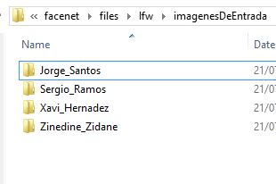
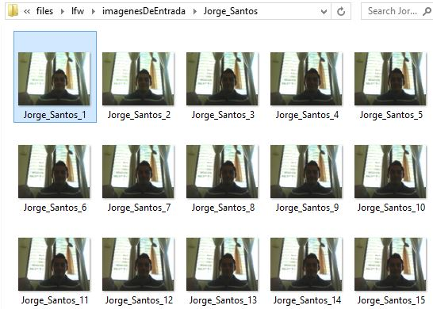
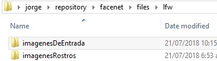
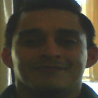
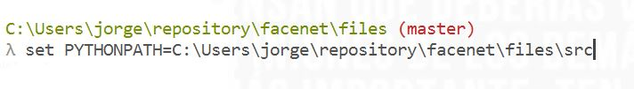
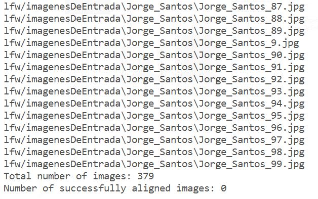
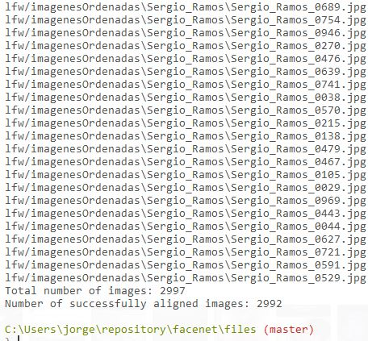
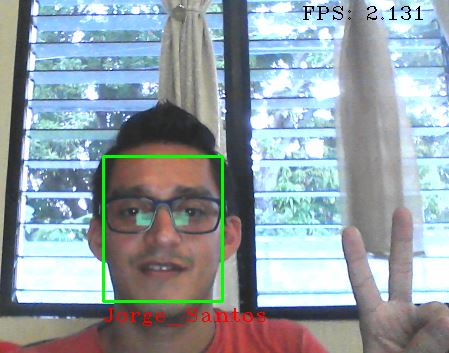
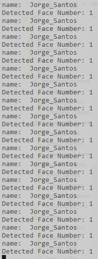

# Proyecto FACENET

## Requerimientos técnicos.

Los requerimientos para trabajar con facenet son:

1. Descargar e instalar Python 3.6, [del sitio oficial](https://www.python.org/downloads/windows/), buscar la seccion "Python 3.6.6 - 2018-06-27" y seleccionar " Windows x86-64 executable installer"
2. Instalar python 3.6.6 en windows con el asistente, incluir pip.
3. instalar dependencias para python 3.6.6 desde linea de comandos:
```
py -m pip install --upgrade pip
py -m pip install scipy==1.1.0
py -m pip install tensorflow==1.13.1
py -m pip install opencv-python==4.1.0
py -m pip install numpy==1.14.5
py -m pip install sklearn==0.21.1
py -m pip install Pillow==6.0.0
py -m pip install matplotlib==3.1.0
```

4. Comprobar si openCv esta correctamente instalado en python 3.6.6
```
py
import cv2
print(cv2.__version__)
```

Puede utilizar las siguientes guias de referencia para python 2.7:

 * [Instalar python 2.7 y pip](https://github.com/BurntSushi/nfldb/wiki/Python-&-pip-Windows-installation)
 * [Instalar open CV en python 2.7](https://opencv-python-tutroals.readthedocs.io/en/latest/py_tutorials/py_setup/py_setup_in_windows/py_setup_in_windows.html)
 * [Manual para instalar numpy en python 2.7](manuales/numpy/readme.md)
 * [Manual para instalar matplotlib en python 2.7](manuales/matplotlib/readme.md)
 * [How To Fix MSVCP140 DLL Is Missing Error On Windows 7 , Windows 10, Windows 8](https://www.youtube.com/watch?v=2o3PTH-Wzmk), [link directo del sitio](https://www.softsuggester.com/msvcp140-dll-is-missing-fix/#Guaranteed_Working_Solution), el nombre del archivo a descargar es "Visual C++ Redist Installer V56"

## 1. Recopilar imagenes para el entrenamiento

Para reconocer rostros debemos alimentar Facenet con un conjunto de imagenes de entrenamiento, estas imagenes puede ser recopiladas de forma manual, por medio de una camara o por medio de un video.   Es pertinente aclarar que este procedimiento es para recopilar imagenes que luego seran alineadas y estas imagenes alineadas son forman el conjunto de datos para el entrenamiento.

El conjunto de datos para el entrenamiento estan formadas por carpetas e imagenes.    Una carpeta representa el nombre de una persona y las imagenes son los archivos que contienen el rostro de una persona.    Es importante recordar que cada imagen debe contener un solo rostro de una persona.

El formato para guardar el nombre de una carpeta de de las imagenes se describe a continuacion:


| Tipo | Partes | Formato | Ejemplo |
| ------ | ------ | ------ | ------ |
| Carpeta | Dos | Parte1_Parte2 | Jorge_Santos |
| Imagen | Tres | Parte1_Parte2_numeroDeImagen | Jorge_Santos_1.jpg |


El ejemplo de las carpetas para el entrenamiento es el siguiente:



El ejemplo de las imagenes de una carpeta es el siguiente:




### Pasos para capturar imagenes por medio de la camara.

1. Ubicarse en el directorio /facenet/files/DTL/ por medio de la consola.

2. Ejecutar el archivo "camera.py", puede usar los parametros:

| Parametro | Valor predeterminado | 
| ------ | ------ | 
| --first_name | first | 
| --last_name | last | 
| --directory | ..\lfw\imagenesDeEntrada | 
| --index | 1 | 
| --maxFileNumber | 1 | 
| --extension | .jpg | 
| --cameraNumber | 0 | 

Ejemplos por consola:
```sh
* py camera.py --first_name jorge --last_name santos --maxFileNumber 10 
* py camera.py --first_name jorge --last_name santos --maxFileNumber 10 --directory ..\imgs\imagenesDeEntrada
```
El resultado de la ejecucion del archivo camera.py con el directorio predeterminado es el sisguiente:




### Pasos para capturar imagenes por medio de un video

1. Ubicarse en el directorio /facenet/files/DTL/ por medio de la consola.

2. Ejecutar el archivo "video.py", puede usar los parametros:

| Parametro | Valor predeterminado | 
| ------ | ------ | 
| --videoName | videoName | 
| --videoExtension | .mp4 | 
| --videoFolder | video | 
| --outDirectory | ..\lfw\imagenesDeEntrada | 
| --index | 1 | 
| --maxFileNumber | 1 | 
| --imageExtension | .jpg | 
| --imageName |  | 
| --startInFrame | .jpg | 
| --cameraNumber | 0 | 
| --saveWithAkey  | 0 |

Ejemplos por consola:
```sh
* py video.py --videoFolder  videos --videoName Jose_Mourinho --maxFileNumber 5 --startInFrame 100 
* py video.py --videoFolder  videos --videoName Cristiano_Ronaldo1 --maxFileNumber 1000 --startInFrame 100 --imageName Cristiano_Ronaldo
```
El resultado de la ejecucion del archivo video.py es el sisguiente:


## 2. Enumerar las imágenes y ordenarlas en formato Parte1_parte2_001.jpg

Las imágenes de la carpeta "imagenesDeEntrada" pueden estar numeradas en la tercera parte del nombre, pero es posible que no sean correlativas, es decir que existe el numero 1,2,3,6 y 7.   Además existe el inconveniente cuando hay mas de 9 imágenes, la forma de listarlas es la siguiente 1,10,2,3.... porque al ser texto, la lista de las imágenes inician con 1.  

En el paso siguiente "verificación" es necesario que las imágenes sean correlativa porque se obtienen dos imagenes de forma aleatoria a partir del rango de imágenes.  El rango es obtenido al listar las imágenes de cada carpeta ordenadas por nombre, es decir que la primera imagen contiene el valor menor del rango y la última imágen contiene el número mayor del rango.    

La solución a este inconveniente es convertir del formato Parte1_parte2_1.png a Parte1_parte2_0001.png, es decir que tenemos un rango de 0 a 9,999.  Los pasos para realizar este proceso es el siguientes:

1. Abrir la consola y ubicarse en la carpeta "facenet/files/DTL"
2. ejecutar la sentencia "py orderData.py", los parametros permitidos son:

| Parametro | Valor predeterminado | 
| ------ | ------ | 
| --inputDirectory | ..\\lfw\\imagenesDeEntrada\\ | 
| --outputDirectory | ..\\lfw\\imagenesOrdenadas | 

Ejemplo de codigo completo:
```
py files/DTL/orderData.py
```

## 3. Conjunto de imagenes de entrenamiento.

El conjunto de imagenes recopiladas en el paso previo seran utilizada para generar el conjunto de imagenes de entrenamiento.   El conjunto de imagenes de entrenamiento contiene los rostos de las imagenes originales.   Note la diferencia entre una imagen original y una imagen de entrenamiento.


Imagen original


Imagen de entrenamiento




Los pasos para convertir las imagenes originales en imagenes con solo el rostro de la persona son el siguiente:

1. Establecer la variable de ambiente donde se encuentran los archivos de facenet.   Ejecute el siguiente comando desde la linea de comandos segun su sistema operativo.


Ubuntu

```
export PYTHONPATH=/notebooks/src
```

Windows

```
set PYTHONPATH=C:\Users\jorge\repository\facenet\files\src
```


Ejemplo de la variable de entorno desde windows





2. Recortar las imagenes originales, debe ubicarse por linea de comandos en el directorio "facenet/" ejecutando la siguiente sentencia desde la linea de comandos:

```
py files/src/align/align_dataset_mtcnn.py files/lfw/imagenesOrdenadas files/lfw/imagenesRostros --image_size 160 --margin 32 --random_order --gpu_memory_fraction 0.25
```

El resultado despues de la ejecucion de la sentencia anterior deberia ser similar al siguiente:





### 4. Crear el archivo pairs.txt

El archivo pairs.txt contiene informacion las imagenes y carpetas elegidas para realizar la validación del modelo.   Para generar el archivo se deben seguir los pasos siguientes:

1. Usando una consola debe ubicarse en la carpeta "files/pairFile" y ejecutar el comando "py createPairsFiles.py"
2. Usando la consola debe ubicarse en la raiz del proyecto y ejecutar el comando:

```
py files/pairFile/createPairsFiles.py
```

Despues de ejecutar la opcion 1 o 2 debe visualizar la carpeta files/pairFile el archivo pairs.txt 

Los parametros opcionales para ejecutar el archivo createPairsFiles.py son los siguientes:


| Parametro | Valor predeterminado | 
| ------ | ------ | 
| --baseDir | ../lfw/imageneesRostros/ | 
| --filePath | pairs.txt | 
| --separate | _0 | 


## 5. Ejecutar el proceso de validación

El proceso de validación es para determinar la exactitud del modelo.  Ejecute los comandos siguientes:

1. Ubicarse en la carpeta "facenet/" por medio de la consola de comandos.
2. ejecutar la sentencia "py files/src/validate_on_lfw.py files/lfw/imagenesRostros files/models/20180402-114759 --distance_metric 1 --use_flipped_images --subtract_mean --use_fixed_image_standardization --lfw_pair files/pairFile/pairs.txt  --lfw_batch_size 23"

En este ejemplo hay tres carpetas con 1,000 imágenes cada una, es decir que validamos el modelo con 3,000, el tiempo estimado de entrenamiento es de 30 minutos.

La computadora endonde se esta probando el ejemplo es una core i5-3210m DE 2.5 GHz y 8GB de RAM.

Al finalizar el proceso de validación, el resultado debe ser similar al siguiente:




## 5. Crear el clasificador

El clasificador que vamos a crear tiene el nombre "lfw_classifier1000x35.pkl"

1. Ubicarse en la carpeta "facenet/files" por medio de la consola de comandos.
2. ejecutar el comando:

```
 "py files/src/classifier.py TRAIN files/lfw/imagenesRostros files/models/20180402-114759/20180402-114759.pb files/models/20180402-114759/lfw_classifier1000x35.pkl --batch_size 1000 --min_nrof_images_per_class 40 --nrof_train_images_per_class 35 --use_split_dataset"
```

## 6. Abrir el demo 

Para probar el reconocimiento de imágenes debe seguir los pasos siguientes:

1. Ubicarse en la carpeta "facenet/" por medio de la consola de comandos.
2. Ejectuar el comando:

```
 "py files/src/testfacenet.py"
```

A continuación se abre la cámara y ya podemos probar el reconocimiento de imágenes.   Un ejemplo del resultado final es el siguiente:




La consola deberia mostrar mensajes similares a los siguientes:



# Implementation

Facenet with Hikvision DVR model DS-7108HGHI-F1 (page 11), use the next link to know the rtsp url https://www.ispyconnect.com/man.aspx?n=hikvision&page=10

# Documents

* [Google news](https://www.unocero.com/noticias/ciencia/google-nuestro-sistema-de-reconocimiento-de-rostros-es-el-mejor/)
* [Facenet documentarion](https://arxiv.org/pdf/1503.03832.pdf)
* [KNN Algoritm](https://www.analiticaweb.es/algoritmo-knn-modelado-datos/)
* [K-means algoritm](https://es.wikipedia.org/wiki/K-means)
* [Download facenet dataset](http://vis-www.cs.umass.edu/lfw/#download)
